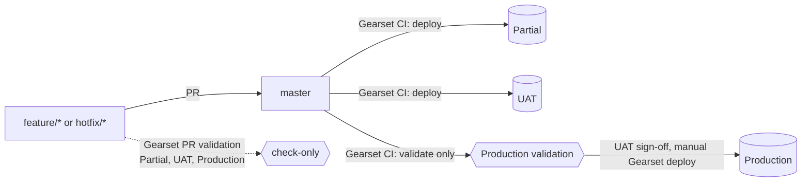

# Salesforce CI/CD: single `master` branch, Gearset CI jobs, GitHub Actions quality gates

Automation for **Partial sandbox, UAT and Production**, one GitHub repository in **SFDX source format**, one long-lived `master` branch, **Gearset** CI jobs for validation and sandbox deployments, and GitHub Actions for everything Gearset does not show.

| Deliverable | Where |
|-------------|-------|
| Target pipeline, what it fixes, remaining risks and their containment | `docs/01-critique-and-recommendation.md` |
| Gearset CI job configuration, manual Production release, API and webhook integration | `docs/02-gearset-integration.md` |
| Error handling and rollback runbook | `docs/03-error-handling-and-rollback.md` |
| Step-by-step setup: Gearset jobs, secrets, variables, branch protection, markers | `docs/04-setup-guide.md` |
| What each script does and what it changes (git, org, GitHub, Gearset) | `docs/05-scripts-reference.md` |
| History of the sessions that produced this repo | `docs/SESSION-HISTORY.md` |
| PR creation script | `scripts/create-pr.sh` |

## The flow



1. A developer or admin opens a PR against `master`, by hand or with `scripts/create-pr.sh` (which can also pull metadata out of a sandbox first).
2. Gearset validates the PR against **Partial, UAT and Production** (three CI jobs with PR validation). GitHub Actions adds the exact delta the merge will deploy, flags deletions, and runs static analysis.
3. On merge, Gearset deploys `master` to **Partial and UAT** and runs a **validate-only** job against Production.
4. After UAT sign-off, a release manager deploys `master` to Production from Gearset and moves the `deployed/production` tag.

## Repository layout

```
.github/workflows/
  pr-validate.yml        "PR checks": delta artifact, deletion flag, static analysis, PR comment, optional CLI validation
  deploy-on-merge.yml    "Deploy on merge": Partial -> UAT -> Production validation, via Gearset API or Salesforce CLI
                         (inert in the default gearset-auto mode, where Gearset triggers itself)
  _sf-deploy.yml         reusable Salesforce CLI validate/deploy for one org (CLI paths only)
  rollback.yml           "Rollback": reverse-delta rollback of a sandbox (or Production) + PR that re-aligns master
  gearset-callback.yml   "Gearset callback": receives Gearset outgoing webhooks, records deployments, opens failure issues
scripts/
  create-pr.sh           commit metadata (local paths or retrieved from an org) to a feature branch and open a PR
  sf-delta.sh            sfdx-git-delta wrapper with "before" sha fallbacks and summaries
  sf-deploy.sh           validate / deploy / quick-deploy with parsed component and test failures
  gearset-run.sh         start a Gearset CI job via the Automation API and wait for it
  rollback.sh            build and deploy the reverse delta
sfdx-project.json, .forceignore, .sgdignore, .sgdignore-destructive
.github/CODEOWNERS, .github/pull_request_template.md
```

## Quick start

1. Create the two new Gearset CI jobs (`docs/04-setup-guide.md` section 4.2).
2. Set the GitHub variables and secrets you need for your `DEPLOY_ENGINE` (4.3) and, only for the Salesforce CLI paths, the GitHub Environments (4.4).
3. Protect `master` with the Gearset checks and `Delta package` as required checks (4.5).
4. Bootstrap the `deployed/<env>` tags (4.6) and run the first-run checklist (4.7).

Create a PR from the command line:

```bash
# local changes
scripts/create-pr.sh -m "ACC-123 account scoring" -p force-app/main/default/classes/AccountScoring.cls

# metadata built in the Partial sandbox by an admin
scripts/create-pr.sh -m "Lead routing flow" -o partial -r "Flow:Lead_Router" -r "CustomField:Lead.Region__c"
```

## Design choices worth knowing

- **Gearset owns validation and sandbox deployments**; GitHub Actions never deploys unless you set `DEPLOY_ENGINE=sf`.
- **Production is validated on every PR and after every merge, but deployed by a person.** The validate-only job proves `master` is releasable; the release itself is a deliberate step after UAT sign-off.
- **`deployed/<env>` tags** record what is live in each org. `git log deployed/production..master` lists what is waiting for a release. They also drive the Rollback workflow.
- **Destructive changes** are flagged on every PR, and fields, objects, profiles, permission sets and flows are never deleted automatically by the CLI path (`.sgdignore-destructive`). Keep "delete removed components" off on the Production CI job.
- **One deployment run at a time** on `master`, never cancelled mid-flight.
