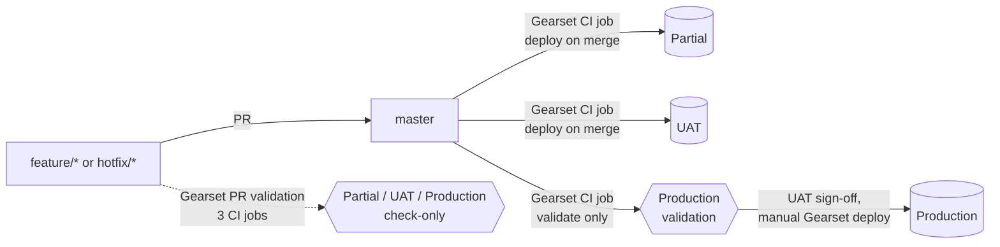

# 1. Target pipeline, and an honest look at its risks

## 1.1 Where you are

- One GitHub repository in **SFDX source format** (`sfdx-project.json`, `force-app/main/default/...`). `master` is the only long-lived branch.
- One Gearset CI job, `master -> Partial sandbox`, with pull-request validation on: every PR to `master` is validated against Partial, and every merge is deployed to Partial.
- Production is deployed from `master` with Gearset.

## 1.2 Where you want to be

| Gearset CI job | Source | Target | On a PR | On merge to `master` |
|----------------|--------|--------|---------|----------------------|
| `master -> Partial` (existing) | `master` | Partial sandbox | validate | deploy |
| `master -> UAT` (new) | `master` | UAT sandbox | validate | deploy |
| `master -> Production (validate only)` (new) | `master` | Production | validate | validate only, nothing deployed |

Production is deployed by a release manager in Gearset after UAT sign-off. GitHub Actions adds what Gearset does not: the exact delta a PR will deploy with deletions flagged, static analysis, a rollback workflow, optional Salesforce CLI validation, and an optional API-sequenced mode. Setup is in `docs/04-setup-guide.md`.

## 1.3 What this fixes compared with today

| Risk today | With the three CI jobs |
|------------|------------------------|
| A PR is validated against Partial only. Production-specific failures (coverage, dependencies, org differences) show up at deployment time. | Every PR is validated against **Production** and **UAT** before it can be merged. Production deployments stop failing on surprises. |
| UAT is refreshed by hand or not at all. | UAT always equals `master`, minutes after each merge. |
| Nothing tells you whether `master` as a whole is deployable to Production. | The validate-only job checks the **cumulative** difference between `master` and Production on every merge. |
| Production deploys are a big-bang comparison in Gearset with no record in git. | The `deployed/production` tag (moved after each production deployment) makes `git log deployed/production..master` the list of what is pending. |

## 1.4 Risks that remain, and how to contain them

These are the consequences of a single `master` that runs ahead of Production while UAT is testing. None of them is a reason not to proceed; they are the things to watch.

| # | Risk | Containment |
|---|------|-------------|
| 1 | **Everything merged is on its way to Production.** If three features are merged and UAT rejects one, you cannot deploy the other two from git without a revert. | Merge a PR only when it is meant for the next release. Revert the rejected feature's merge commit with a PR (the revert deploys to Partial and UAT automatically). Keep PRs small. If this happens often, environment branches (Gearset Pipelines) are the standard answer; it is deliberately out of scope here. |
| 2 | **Partial component selection in Gearset diverges from git.** Deploying "just the hotfix" by hand-picking components in Gearset leaves Production at a state no commit describes. | Deploy the whole `master -> Production` difference. For a true emergency, deploy the hotfix's components, then immediately move `deployed/production` to the hotfix commit only after the rest is deployed too, and note the exception in the PR. |
| 3 | **A validation is not a deployment.** The Production validate-only run passes, someone changes Production by hand the next day, and the real deployment fails. | Deploy soon after a green validation, re-run the validate-only job before deploying (Gearset > CI job > Run now), and lock down Setup access in Production. |
| 4 | **Three PR validations per PR.** Each PR now triggers three Gearset validations, and Production with `RunLocalTests` can take a while. | Draft PRs are not validated; open the PR as a draft while iterating. Watch Gearset's concurrency limits if many PRs are open at once. |
| 5 | **UAT is tested after merge.** A defect found in UAT is already in Partial and `master`. | That is acceptable when Production is the manual gate, which it is. Fix forward with a new PR; revert only when the feature must be pulled. |
| 6 | **Org-specific metadata.** Settings, named credentials, remote site settings, connected apps differ per org and must not be pushed from `master` to three orgs. | `.forceignore` excludes them from CLI deployments; mirror the same exclusions in each Gearset CI job's metadata filter. Manage them by hand in each org and list manual steps in the PR template. |
| 7 | **Destructive changes.** A file deletion in `master` becomes a deletion in Partial and UAT on merge. | The PR checks workflow flags deletions in the PR comment and the delta artifact. Gearset CI jobs deploy deletions only if the job's "delete removed components" option is on; keep it off for Production. |

## 1.5 Why GitHub Actions is still worth keeping next to Gearset

- **Visibility of the change set.** Gearset shows what it deployed after the fact; the `PR checks` workflow shows the exact `package.xml` and `destructiveChanges.xml` before merge.
- **Static analysis** on changed files (Salesforce Code Analyzer) with no Gearset licence dependency.
- **Rollback for sandboxes** with git as the source of truth, and a PR that keeps `master` aligned.
- **Optional sequencing.** `DEPLOY_ENGINE=gearset-api` runs Partial, then UAT, then the Production validation in order and stops at the first failure, instead of three independent jobs firing from the webhook.
- **Exit path.** `DEPLOY_ENGINE=sf` deploys the same three steps with the Salesforce CLI if Gearset is ever unavailable.
